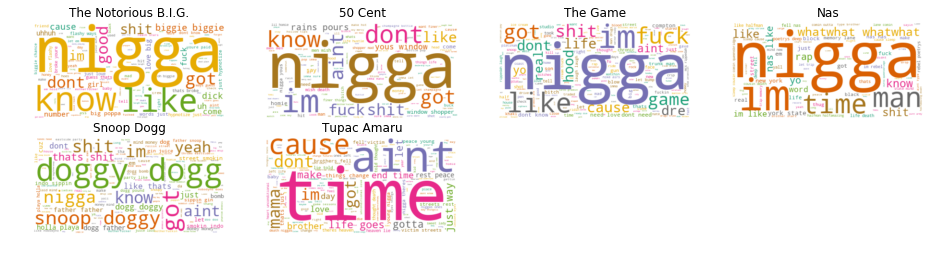
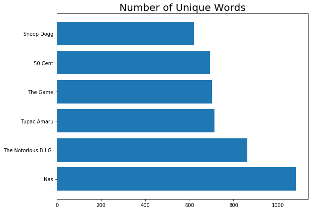
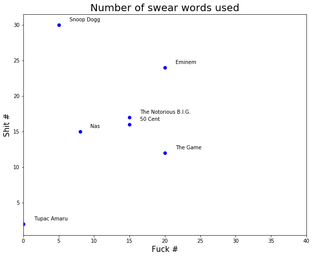
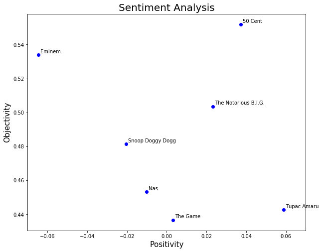

[](https://mybinder.org/v2/gh/Xeragus/What-Do-Rappers-Say/master)


48 years and three days ago, on June 16, a boy named Lesane Parish Crooks was born. This is my way of remembering your birthday, Pac. 
"Make sure it's poppin' when we get up there, man, don't front".

## Mic check / Introduction
Rap music has been one of the most influential music genres for the biggest part of the last quarter century. It all started by the name of "Rhythm and Poetry", meaning, words mean the world here. This data analysis will try to shed more light on the way the most influential rappers, well, rap.

The purpose of this project is to analyze 5 songs per rapper. We analyze 7 rappers, meaning our data will contain lyrics from 35 songs. The goal of our analysis is to make conclusions on the positivity and the subjectivity of the rappers, as well as the size of their vocabulary.

This project, as hopefully every other data science project, will go through the notorious process of "Data Cleaning". It's boring and all that, yet it's absoulutely vital for the sanity of our results. If you put sour food in the juicer, you can't really expect not to get sour juice, right? Feed a model with bad data, it feeds you with bad results. In the world of data science, it's almost impossible to completely clean your data, yet we should always try to minimize the garbage, so we can maximize the correctness of our output.

Clean data is not enough. We need properly structured data. Why? Well, algorithms have a thing for properly structured data. Organizing data in the right way makes it easier for algorithms to extract better information.

It's worth noting that the choice of rappers and songs is totally subjective. You could to this analysis for any musician, author, poet or any other text content producer. Good luck with cleaning data for mumble rap lyrics though.

That said, let's see the final list of steps we will go through before we actually do some really cool stuff with our data:

1. Optain data
2. Clean data
3. Structure data
    1. **Corpus** - collection of song lyrics from every rapper
   
    2. **Word Matrix** - matrix format of every word used in the Corpus
    
As we will notice, the "Clean data" and "Structure data" steps are dependent and could be executed in parallel.

## 1. Optain data
Here is the list of rappers and songs we will optain data for:
1. Tupac Amaru Shakur
    1. "Life Goes On"
    2. "Unconditional Love"
    3. "Changes"
    4. "Until The End Of Time"
    5. "Dear Mama"
2. The Notorious B.I.G.
    1. "Ten Crack Commandments"
    2. "Hypnotize"
    3. "Juicy"
    4. "One More Chance"
    5. "Big Poppa"
3. Snoop Doggy Dogg
    1. "What's My Name?"
    2. "Gin And Juice"
    3. "That's That Shit"
    4. "The Doggfather"
    5. "Eastside Party"
4. Nas
    1. "N.Y. State Of Mind"
    2. "Nas Is Like"
    3. "Surviving The Times"
    4. "The Message"
    5. "Memory Lane"
5. The Game
    1. "Where I'm From"
    2. "One Night"
    3. "Don't Need That Love"
    4. "Laugh"
    5. "Too Much"
6. 50 Cent
    1. "Hustler's Ambition"
    2. "Window Shopper"
    3. "If I Can't"
    4. "Many Men"
    5. "When It Rains It Pours"
7. Eminem
    1. "Rap God"
    2. "Phenomenal"
    3. "Wicked Ways"
    4. "Kings Never Die"
    5. "The Ringer"

We will find the lyrics on www.genius.com and store the URLs in variables:
    


```python
# We will use Requests and BeatufiulSoup for scraping
import requests
from bs4 import BeautifulSoup
# We will use Pickle and OS to create folders and and store files
import pickle
import os
# We will use Pandas to structure and maintain our data
import pandas
# We will use Re and String modules when we start cleaning our data
import re
import string
# We will use this module in the 'Cleaning Data' and 'Structure Data' steps
from sklearn.feature_extraction.text import CountVectorizer

# Storing URLs to the Tupac songs lyrics
tupac_urls = ['https://genius.com/2pac-life-goes-on-lyrics',
             'https://genius.com/2pac-unconditional-love-lyrics',
             'https://genius.com/2pac-changes-lyrics',
             'https://genius.com/2pac-until-the-end-of-time-lyrics',
             'https://genius.com/2pac-dear-mama-lyrics']

# Storing URLs to the Biggie songs lyrics
biggie_urls = ['https://genius.com/The-notorious-big-ten-crack-commandments-lyrics',
              'https://genius.com/The-notorious-big-one-more-chance-lyrics',
              'https://genius.com/The-notorious-big-big-poppa-lyrics',
              'https://genius.com/The-notorious-big-juicy-lyrics',
              'https://genius.com/The-notorious-big-hypnotize-lyrics']

# Storing URLs to the Snoop songs lyrics
snoop_urls = ['https://genius.com/Snoop-dogg-gin-and-juice-lyrics',
             'https://genius.com/Snoop-dogg-thats-that-shit-lyrics',
             'https://genius.com/Snoop-dogg-tha-doggfather-lyrics',
             'https://genius.com/Snoop-dogg-eastside-party-lyrics',
             'https://genius.com/Snoop-dogg-who-am-i-lyrics']

# Storing URLs to the Nas songs lyrics
nas_urls = ['https://genius.com/Nas-surviving-the-times-lyrics',
           'https://genius.com/Nas-nas-is-like-lyrics',
           'https://genius.com/Nas-ny-state-of-mind-lyrics',
           'https://genius.com/Nas-the-message-lyrics',
           'https://genius.com/Nas-memory-lane-sittin-in-da-park-lyrics']

# Storing URLs to the The Game songs lyrics
game_urls = ['https://genius.com/The-game-where-im-from-lyrics',
            'https://genius.com/The-game-one-night-lyrics',
            'https://genius.com/The-game-dont-need-your-love-lyrics',
            'https://genius.com/The-game-laugh-lyrics',
            'https://genius.com/The-game-too-much-lyrics']

# Storing URLs to the 50 Cent songs lyrics
fifty_urls = ['https://genius.com/50-cent-many-men-wish-death-lyrics',
            'https://genius.com/50-cent-hustlers-ambition-lyrics',
            'https://genius.com/50-cent-if-i-cant-lyrics',
            'https://genius.com/50-cent-window-shopper-lyrics',
            'https://genius.com/50-cent-when-it-rains-it-pours-lyrics']

eminem_urls = ['https://genius.com/Eminem-rap-god-lyrics',
               'https://genius.com/Eminem-phenomenal-lyrics',
              'https://genius.com/Eminem-wicked-ways-lyrics',
              'https://genius.com/Eminem-kings-never-die-lyrics',
              'https://genius.com/Eminem-the-ringer-lyrics']
```

Next, we need a function that will take a URL and return the scraped text.


```python
# Function that takes a URL as parameter, scrapes the Genius page at that URL, extracts and returns the lyrics
def fetch_lyrics(url):
    print(url)
    
    page = requests.get(url)
    html = BeautifulSoup(page.text, "html.parser")
    lyrics = html.find("div", class_="lyrics").get_text()
    
    return lyrics
```

Now that we have a function, we will use it to fetch lyrics. This could take a couple of minutes. You will see the URL of the scraped page printed out.


```python
# We will store the lyrics in this dictionary
lyrics = {}
lyrics['tupac'] = [fetch_lyrics(url) for url in tupac_urls]
lyrics['biggie'] = [fetch_lyrics(url) for url in biggie_urls]
lyrics['snoop'] = [fetch_lyrics(url) for url in snoop_urls]
lyrics['nas'] = [fetch_lyrics(url) for url in nas_urls]
lyrics['game'] = [fetch_lyrics(url) for url in game_urls]
lyrics['fifty'] = [fetch_lyrics(url) for url in fifty_urls]
lyrics['eminem'] = [fetch_lyrics(url) for url in eminem_urls]
```

    https://genius.com/2pac-life-goes-on-lyrics
    https://genius.com/2pac-unconditional-love-lyrics
    https://genius.com/2pac-changes-lyrics
    https://genius.com/2pac-until-the-end-of-time-lyrics
    https://genius.com/2pac-dear-mama-lyrics
    https://genius.com/The-notorious-big-ten-crack-commandments-lyrics
    https://genius.com/The-notorious-big-one-more-chance-lyrics
    https://genius.com/The-notorious-big-big-poppa-lyrics
    https://genius.com/The-notorious-big-juicy-lyrics
    https://genius.com/The-notorious-big-hypnotize-lyrics
    https://genius.com/Snoop-dogg-gin-and-juice-lyrics
    https://genius.com/Snoop-dogg-thats-that-shit-lyrics
    https://genius.com/Snoop-dogg-tha-doggfather-lyrics
    https://genius.com/Snoop-dogg-eastside-party-lyrics
    https://genius.com/Snoop-dogg-who-am-i-lyrics
    https://genius.com/Nas-surviving-the-times-lyrics
    https://genius.com/Nas-nas-is-like-lyrics
    https://genius.com/Nas-ny-state-of-mind-lyrics
    https://genius.com/Nas-the-message-lyrics
    https://genius.com/Nas-memory-lane-sittin-in-da-park-lyrics
    https://genius.com/The-game-where-im-from-lyrics
    https://genius.com/The-game-one-night-lyrics
    https://genius.com/The-game-dont-need-your-love-lyrics
    https://genius.com/The-game-laugh-lyrics
    https://genius.com/The-game-too-much-lyrics
    https://genius.com/50-cent-many-men-wish-death-lyrics
    https://genius.com/50-cent-hustlers-ambition-lyrics
    https://genius.com/50-cent-if-i-cant-lyrics
    https://genius.com/50-cent-window-shopper-lyrics
    https://genius.com/50-cent-when-it-rains-it-pours-lyrics
    https://genius.com/Eminem-rap-god-lyrics
    https://genius.com/Eminem-phenomenal-lyrics
    https://genius.com/Eminem-wicked-ways-lyrics
    https://genius.com/Eminem-kings-never-die-lyrics
    https://genius.com/Eminem-the-ringer-lyrics


We could print out the lyrics collection for one rapper just to see that our scraping was successful.


```python
#print(lyrics['tupac'])
```

Now that we have scraped our data, we need to organize it. We will save the lyrics collection for every rapper in a separate file using Pickle, which we imported at the start. Pickle is used in Python for object serialization. The files will be saved in a directory that we will create, if it doesn't already exist.


```python
# Create the directory where we will keep the lyrics files
if not os.path.exists('lyrics'):
    os.makedirs('lyrics')
    
rappers = ['tupac', 'biggie', 'snoop', 'nas', 'game', 'fifty', 'eminem']

# Create named files
for i, rapper in enumerate(rappers):
    with open("lyrics/" + rapper + ".txt", "wb") as file:
        pickle.dump(lyrics[rapper], file)
```

We will read the data from the files and apply a few cleaning techniques to it.


```python
data = {}

for i, rapper in enumerate(rappers):
    with open("lyrics/" + rapper + ".txt", "rb") as file:
        data[rapper] = pickle.load(file)
```

At this point you could check if data was loaded correctly. We are done with obtaining data, now we proceed to the second step, cleaning data.


```python
#data.keys()
```


```python
#data['tupac']
```

Notice that we actually have a list of song lyrics instead of one single text.

## 2. Clean Data 
The techniques used to clean textual data are called "text pre-processing techniques". We will use few of those, but won't go to any advanced data cleaning. We will go through the following techniques:
1. Remove garbage characters (like "/n", "[]" and so on)
2. Remove punctuation
3. Remove numerical values
4. Make all text lowercase
5. Remove stop words

First, we will structure the data in a better way. As noticed before, our data per rapper is a list of lyrics. So, we have to transform it into one single text. We will write a function that will accept a list of lyrics and will return one single text. That can only mean one thing...

## 3. Structure data
So, first we will merge our data into single text, and then we will put it in the following formats:
- Corpus - collection of song lyrics from every rapper
- Word Matrix - matrix format of every word used in the Corpus

We will move back and forth between cleaning and structuring data, as we can't efficiently clean badly structured data.


```python
def merge_lyrics(list_of_lyrics):
    merged_text = ' '.join(list_of_lyrics)
    return merged_text

merged_data = {key: [merge_lyrics(value)] for (key, value) in data.items()}
```

Let's try it out. We will print the data before and after executing this function.


```python
#data['tupac']
```


```python
#merged_data['tupac']
```

That's better. Our data in the moment is in the dictionary format. We will put it in pandas dataframe, or we will re-structure it. 

We kinda already have our data in the Corpus format, now we will create Pandas dataframe from it. Why? Because it will be easier to clean our data if it is structured in a dataframe.


```python
pandas.set_option('max_colwidth',150)

lyrics_dataframe = pandas.DataFrame.from_dict(merged_data).transpose()
lyrics_dataframe.columns = ['lyrics']
lyrics_dataframe = lyrics_dataframe.sort_index()
```

We will check to see if our dataframe is what we expect it to be.


```python
#lyrics_dataframe
```

Now we could take a look at Tupac's (or any other rapper's) data.


```python
#lyrics_dataframe.lyrics.loc['eminem']
```

Now that we have our data restructured we move on to the second data cleaning technique that we will apply: remove garbage characters.


```python
def remove_garbage_characters(lyrics):
    # remove data in brackets
    lyrics = re.sub('\[.*?\]', '', lyrics)
    # remove multiple "\n" characters with ''
    lyrics = re.sub('\n{2,}', '', lyrics)
    # remove single "\n" character with ' '
    lyrics = re.sub('\n', ' ', lyrics)
    return lyrics

garbage_characters_removal_technique = lambda x: remove_garbage_characters(x)

clean_data = pandas.DataFrame(lyrics_dataframe.lyrics.apply(garbage_characters_removal_technique))
```

We could check to see if there are any changes in the data.


```python
#clean_data.lyrics.loc['eminem']
```

We move on to the third data cleaning step: remove all punctuation.


```python
def remove_punctuation(lyrics):
    lyrics = re.sub('[%s]' % re.escape(string.punctuation), '', lyrics)
    lyrics = re.sub('[‘’“”…]', '', lyrics)
    return lyrics

remove_punctuation_technique = lambda x: remove_punctuation(x)

clean_data = pandas.DataFrame(clean_data.lyrics.apply(remove_punctuation_technique))
```

See where we are:


```python
#clean_data.lyrics.loc['tupac']
```

That's beautiful. If you run the last line of code, you will notice that we still have numbers in the text. We don't need numbers, so let's remove them.


```python
def remove_numerical_values(lyrics):
    lyrics = re.sub('\w*\d\w*', '', lyrics)
    return lyrics

remove_numerical_values_technique = lambda x: remove_numerical_values(x)

clean_data = pandas.DataFrame(clean_data.lyrics.apply(remove_numerical_values_technique))
```


```python
#clean_data.lyrics.loc['tupac']
```

Do you see any numbers? I don't. So we are doing good. Let's make all text lowercase now.


```python
def transform_to_lowercase(lyrics):
    lyrics = lyrics.lower()
    return lyrics

transform_to_lowercase_technique = lambda x: transform_to_lowercase(x)

clean_data = pandas.DataFrame(clean_data.lyrics.apply(transform_to_lowercase_technique))
```

Let's check it out.


```python
#clean_data.lyrics.loc['eminem']
```

We will now add the full artist name of the rappers in our dataframe.


```python
rappers_full_names = ['The Notorious B.I.G.', 'Eminem', '50 Cent', 'The Game', 'Nas', 'Snoop Doggy Dogg', 'Tupac Amaru']

clean_data['name'] = rappers_full_names

clean_data.to_pickle("corpus.pkl")

clean_data
```


<div>
<table border="1" class="dataframe">
  <thead>
    <tr style="text-align: right;">
      <th></th>
      <th>lyrics</th>
      <th>name</th>
    </tr>
  </thead>
  <tbody>
    <tr>
      <th>biggie</th>
      <td>the ten crack commandments what nigga cant tell me nothing about this coke cant tell me nothing about this crack this weed for my hustlin...</td>
      <td>The Notorious B.I.G.</td>
    </tr>
    <tr>
      <th>eminem</th>
      <td>look i was gonna go easy on you not to hurt your feelings but im only going to get this one chance somethings wrong i can feel it six minutes six ...</td>
      <td>Eminem</td>
    </tr>
    <tr>
      <th>fifty</th>
      <td>man we gotta go get somethin to eat man im hungry as a motherfucker ayo man damn whats takin homie so long son  calm down he coming  gunshots ahh ...</td>
      <td>50 Cent</td>
    </tr>
    <tr>
      <th>game</th>
      <td>im a bldoubleod been on songs with sndoubleop inside a ferrari with the dre run up i let it sing like nate dodoubleg walk through  mile gunits on ...</td>
      <td>The Game</td>
    </tr>
    <tr>
      <th>nas</th>
      <td>but thats the whole tragic point my friends what would i do if i could suddenly feel and to know once again that what i feel is real i could cry i...</td>
      <td>Nas</td>
    </tr>
    <tr>
      <th>snoop</th>
      <td>ugh hahaha im serious nigga one of yall niggas got some bad motherfuckin breath oh man aye baby aye baby shit aye baby get some bubblegum in this ...</td>
      <td>Snoop Doggy Dogg</td>
    </tr>
    <tr>
      <th>tupac</th>
      <td>how many brothers fell victim to the streets rest in peace young nigga theres a heaven for a g be a lie if i told you that i never thought of deat...</td>
      <td>Tupac Amaru</td>
    </tr>
  </tbody>
</table>
</div>


Now let's move on to the last step of our data cleaning process: remove stop words. But, before we do that, we have to organize our data in a word matrix. We will use CountVectorizer to tokenize the lyrics and we can remove the stop words with the same module. Every row will contain data for a rapper and every column will be a different word.


```python
cv = CountVectorizer(stop_words='english')
tokenized_data = cv.fit_transform(clean_data.lyrics)
word_matrix = pandas.DataFrame(tokenized_data.toarray(), columns=cv.get_feature_names())
word_matrix.index = clean_data.index
```

Let's see our word matrix:


```python
word_matrix
```


<div>
<table border="1" class="dataframe">
  <thead>
    <tr style="text-align: right;">
      <th></th>
      <th>aaaahif</th>
      <th>abandoned</th>
      <th>able</th>
      <th>abuse</th>
      <th>ac</th>
      <th>accident</th>
      <th>accolades</th>
      <th>accomplishments</th>
      <th>account</th>
      <th>accountant</th>
      <th>...</th>
      <th>yous</th>
      <th>youthful</th>
      <th>youve</th>
      <th>youyeah</th>
      <th>zags</th>
      <th>zeros</th>
      <th>zod</th>
      <th>zombie</th>
      <th>zone</th>
      <th>zé</th>
    </tr>
  </thead>
  <tbody>
    <tr>
      <th>biggie</th>
      <td>0</td>
      <td>0</td>
      <td>0</td>
      <td>0</td>
      <td>1</td>
      <td>0</td>
      <td>0</td>
      <td>0</td>
      <td>0</td>
      <td>1</td>
      <td>...</td>
      <td>3</td>
      <td>0</td>
      <td>0</td>
      <td>0</td>
      <td>0</td>
      <td>0</td>
      <td>0</td>
      <td>0</td>
      <td>0</td>
      <td>0</td>
    </tr>
    <tr>
      <th>eminem</th>
      <td>0</td>
      <td>0</td>
      <td>2</td>
      <td>1</td>
      <td>1</td>
      <td>1</td>
      <td>2</td>
      <td>1</td>
      <td>1</td>
      <td>0</td>
      <td>...</td>
      <td>0</td>
      <td>1</td>
      <td>1</td>
      <td>0</td>
      <td>0</td>
      <td>0</td>
      <td>1</td>
      <td>1</td>
      <td>1</td>
      <td>0</td>
    </tr>
    <tr>
      <th>fifty</th>
      <td>0</td>
      <td>0</td>
      <td>0</td>
      <td>0</td>
      <td>0</td>
      <td>0</td>
      <td>0</td>
      <td>0</td>
      <td>0</td>
      <td>0</td>
      <td>...</td>
      <td>12</td>
      <td>0</td>
      <td>0</td>
      <td>1</td>
      <td>0</td>
      <td>0</td>
      <td>0</td>
      <td>0</td>
      <td>0</td>
      <td>0</td>
    </tr>
    <tr>
      <th>game</th>
      <td>1</td>
      <td>1</td>
      <td>0</td>
      <td>0</td>
      <td>0</td>
      <td>0</td>
      <td>0</td>
      <td>0</td>
      <td>0</td>
      <td>0</td>
      <td>...</td>
      <td>0</td>
      <td>0</td>
      <td>0</td>
      <td>0</td>
      <td>0</td>
      <td>0</td>
      <td>0</td>
      <td>0</td>
      <td>0</td>
      <td>0</td>
    </tr>
    <tr>
      <th>nas</th>
      <td>0</td>
      <td>0</td>
      <td>0</td>
      <td>0</td>
      <td>0</td>
      <td>0</td>
      <td>0</td>
      <td>0</td>
      <td>0</td>
      <td>0</td>
      <td>...</td>
      <td>0</td>
      <td>0</td>
      <td>0</td>
      <td>0</td>
      <td>0</td>
      <td>1</td>
      <td>0</td>
      <td>0</td>
      <td>0</td>
      <td>1</td>
    </tr>
    <tr>
      <th>snoop</th>
      <td>0</td>
      <td>0</td>
      <td>0</td>
      <td>0</td>
      <td>0</td>
      <td>0</td>
      <td>0</td>
      <td>0</td>
      <td>0</td>
      <td>0</td>
      <td>...</td>
      <td>0</td>
      <td>0</td>
      <td>0</td>
      <td>0</td>
      <td>1</td>
      <td>0</td>
      <td>0</td>
      <td>0</td>
      <td>1</td>
      <td>0</td>
    </tr>
    <tr>
      <th>tupac</th>
      <td>0</td>
      <td>0</td>
      <td>0</td>
      <td>0</td>
      <td>0</td>
      <td>0</td>
      <td>0</td>
      <td>0</td>
      <td>0</td>
      <td>0</td>
      <td>...</td>
      <td>0</td>
      <td>0</td>
      <td>2</td>
      <td>0</td>
      <td>0</td>
      <td>0</td>
      <td>0</td>
      <td>0</td>
      <td>1</td>
      <td>0</td>
    </tr>
  </tbody>
</table>
<p>7 rows × 3890 columns</p>
</div>


Finally, we will save all data to files:


```python
word_matrix.to_pickle("word_matrix.pkl")

clean_data.to_pickle('clean_data.pkl')
pickle.dump(cv, open("cv.pkl", "wb"))
```

## Mic Check / Introduction
By this point, we have our data as clean and as well structured as possible. Before we go on and apply some cool algorithms to our data, we should first explore and make some basic conclusions about it.

The exploratory data analysis techniques (EDA) are some common patterns which are used to extract some basic information about the distribution of the data, the most common values and so on. The patterns we can conclude from EDA techniques are called "visible", those that require fancy algorithms are called "hidden". Smart, right? 

We will make conclusions on the following 3 questions:
1. What are the most common words used by each rapper?
2. What is the size of the vocabulary (unique words) used by each rapper?
3. What rapper swears the most?

## 1. What are the most common words used by each rapper?
This question requires that we examine the words separately, that's why we are so lucky to have our words matrix. Let's read it in from the file.


```python
import pandas
from sklearn.feature_extraction import text 
from sklearn.feature_extraction.text import CountVectorizer
from wordcloud import WordCloud
import matplotlib.pyplot as plt
import pickle
import numpy as np

data = pandas.read_pickle('word_matrix.pkl')
data = data.transpose()
data.head()
```


<div>
<table border="1" class="dataframe">
  <thead>
    <tr style="text-align: right;">
      <th></th>
      <th>biggie</th>
      <th>eminem</th>
      <th>fifty</th>
      <th>game</th>
      <th>nas</th>
      <th>snoop</th>
      <th>tupac</th>
    </tr>
  </thead>
  <tbody>
    <tr>
      <th>aaaahif</th>
      <td>0</td>
      <td>0</td>
      <td>0</td>
      <td>1</td>
      <td>0</td>
      <td>0</td>
      <td>0</td>
    </tr>
    <tr>
      <th>abandoned</th>
      <td>0</td>
      <td>0</td>
      <td>0</td>
      <td>1</td>
      <td>0</td>
      <td>0</td>
      <td>0</td>
    </tr>
    <tr>
      <th>able</th>
      <td>0</td>
      <td>2</td>
      <td>0</td>
      <td>0</td>
      <td>0</td>
      <td>0</td>
      <td>0</td>
    </tr>
    <tr>
      <th>abuse</th>
      <td>0</td>
      <td>1</td>
      <td>0</td>
      <td>0</td>
      <td>0</td>
      <td>0</td>
      <td>0</td>
    </tr>
    <tr>
      <th>ac</th>
      <td>1</td>
      <td>1</td>
      <td>0</td>
      <td>0</td>
      <td>0</td>
      <td>0</td>
      <td>0</td>
    </tr>
  </tbody>
</table>
</div>


Now let's find the top 50 most commonly used words for each rapper.


```python
top_50 = {}
for c in data.columns:
    top = data[c].sort_values(ascending=False).head(50)
    top_50[c]= list(zip(top.index, top.values))
```

Let's take a look at our results.


```python
#top_50
```

Now, we see that some of this words are just stop words and have no real meaning. We will try to remove them:


```python
# Get the stop words registered in the library
stop_words = text.ENGLISH_STOP_WORDS

clean_data = pandas.read_pickle('clean_data.pkl')

# Update the word matrix
cv = CountVectorizer(stop_words=stop_words)
data_cv = cv.fit_transform(clean_data.lyrics)
data_non_stop_words = pandas.DataFrame(data_cv.toarray(), columns=cv.get_feature_names())
data_non_stop_words.index = clean_data.index

# We will save the updated word matrix
pickle.dump(cv, open("cv_stop.pkl", "wb"))
data_non_stop_words.to_pickle("data_non_stop_words.pkl")
```

Now let's see if our data is clean of stop words.


```python
data = pandas.read_pickle('word_matrix.pkl')
data = data.transpose()
data.head()

top_50 = {}
for c in data.columns:
    top = data[c].sort_values(ascending=False).head(50)
    top_50[c]= list(zip(top.index, top.values))
    
#top_50
```

This one is exciting. Let's create word clouds of the 50 most commonly used words for each rapper.


```python
word_cloud = WordCloud(stopwords=stop_words, background_color="white", colormap="Dark2",
               max_font_size=150, random_state=42)

plt.rcParams['figure.figsize'] = [16, 6]

rappers_data = ';'.join(data.columns)
rappers = []
for item in rappers_data.split(';'): # comma, or other
    rappers.append(item)
    
rappers_full_names = ['The Notorious B.I.G.', 'Eminem', '50 Cent', 'The Game', 'Nas', 'Snoop Dogg', 'Tupac Amaru']

for i, rapper in enumerate(data.columns):
    word_cloud.generate(clean_data.lyrics[rapper])
    
    plt.subplot(3, 4, i+1)
    plt.imshow(word_cloud, interpolation="bilinear")
    plt.axis("off")
    plt.title(rappers_full_names[i])
    
plt.show()
```





So, what is the answer to the question "What are the most common words used by each rapper"?

For B.I.G., 50 Cent, The Game and Nas is the 'N' word, Snoop likes to 'put some respect on his name', and Tupac talks about time and his mother.

## 2. What is the size of the vocabulary (unique words) used by each rapper?
We will try to find out how many different words each rapper uses.


```python
unique_words = []
for rapper in data.columns:
    uniques = (data[rapper]).to_numpy().nonzero()[0].size
    unique_words.append(uniques)
    
unique_words

#We will put the unique word count in a dataframe
data_words = pandas.DataFrame(list(zip(rappers_full_names, unique_words)), columns=['rapper', 'unique_words'])
data_unique_sort = data_words.sort_values(by='unique_words', ascending=False)
data_unique_sort
```


<div>
<table border="1" class="dataframe">
  <thead>
    <tr style="text-align: right;">
      <th></th>
      <th>rapper</th>
      <th>unique_words</th>
    </tr>
  </thead>
  <tbody>
    <tr>
      <th>1</th>
      <td>Eminem</td>
      <td>1475</td>
    </tr>
    <tr>
      <th>4</th>
      <td>Nas</td>
      <td>1080</td>
    </tr>
    <tr>
      <th>0</th>
      <td>The Notorious B.I.G.</td>
      <td>863</td>
    </tr>
    <tr>
      <th>6</th>
      <td>Tupac Amaru</td>
      <td>713</td>
    </tr>
    <tr>
      <th>3</th>
      <td>The Game</td>
      <td>702</td>
    </tr>
    <tr>
      <th>2</th>
      <td>50 Cent</td>
      <td>693</td>
    </tr>
    <tr>
      <th>5</th>
      <td>Snoop Dogg</td>
      <td>622</td>
    </tr>
  </tbody>
</table>
</div>


Now, let's add the total number of words for each rapper to this table.


```python
# Find the total number of words that a comedian uses
total_words_list = []
for rapper in data.columns:
    totals = sum(data[rapper])
    total_words_list.append(totals)
    
# Let's add some columns to our dataframe
data_words['Total words #'] = total_words_list

# Sort the dataframe by words per minute to see who talks the slowest and fastest
data_words
```


<div>
<table border="1" class="dataframe">
  <thead>
    <tr style="text-align: right;">
      <th></th>
      <th>rapper</th>
      <th>unique_words</th>
      <th>Total words #</th>
    </tr>
  </thead>
  <tbody>
    <tr>
      <th>0</th>
      <td>The Notorious B.I.G.</td>
      <td>863</td>
      <td>1725</td>
    </tr>
    <tr>
      <th>1</th>
      <td>Eminem</td>
      <td>1475</td>
      <td>2885</td>
    </tr>
    <tr>
      <th>2</th>
      <td>50 Cent</td>
      <td>693</td>
      <td>1498</td>
    </tr>
    <tr>
      <th>3</th>
      <td>The Game</td>
      <td>702</td>
      <td>1327</td>
    </tr>
    <tr>
      <th>4</th>
      <td>Nas</td>
      <td>1080</td>
      <td>1917</td>
    </tr>
    <tr>
      <th>5</th>
      <td>Snoop Dogg</td>
      <td>622</td>
      <td>1566</td>
    </tr>
    <tr>
      <th>6</th>
      <td>Tupac Amaru</td>
      <td>713</td>
      <td>1686</td>
    </tr>
  </tbody>
</table>
</div>


We can see that Nas used most unique and has the longest verses. Let's plot the unique words analysis:


```python
y_pos = np.arange(len(data_words))

plt.subplot(1, 2, 1)
plt.barh(y_pos, data_unique_sort.unique_words, align='center')
plt.yticks(y_pos, data_unique_sort.rapper)
plt.title('Number of Unique Words', fontsize=20)

plt.tight_layout()
plt.show()
```





Let's finish the Exploratory Data Analysis with the third technique.

## 3. What rapper swears the most?


```python
swear_words = data.transpose()[['bitch', 'nigga', 'fucking', 'fuck', 'shit']]
data_swear_words = pandas.concat([swear_words.nigga, swear_words.bitch, swear_words.fucking + swear_words.fuck, swear_words.shit], axis=1)
data_swear_words.columns = ['nigga', 'bitch', 'fuck', 'shit']
data_swear_words
```


<div>
<table border="1" class="dataframe">
  <thead>
    <tr style="text-align: right;">
      <th></th>
      <th>nigga</th>
      <th>bitch</th>
      <th>fuck</th>
      <th>shit</th>
    </tr>
  </thead>
  <tbody>
    <tr>
      <th>biggie</th>
      <td>12</td>
      <td>3</td>
      <td>15</td>
      <td>17</td>
    </tr>
    <tr>
      <th>eminem</th>
      <td>0</td>
      <td>10</td>
      <td>20</td>
      <td>24</td>
    </tr>
    <tr>
      <th>fifty</th>
      <td>31</td>
      <td>7</td>
      <td>15</td>
      <td>16</td>
    </tr>
    <tr>
      <th>game</th>
      <td>28</td>
      <td>6</td>
      <td>20</td>
      <td>12</td>
    </tr>
    <tr>
      <th>nas</th>
      <td>4</td>
      <td>1</td>
      <td>8</td>
      <td>15</td>
    </tr>
    <tr>
      <th>snoop</th>
      <td>14</td>
      <td>4</td>
      <td>5</td>
      <td>30</td>
    </tr>
    <tr>
      <th>tupac</th>
      <td>15</td>
      <td>1</td>
      <td>0</td>
      <td>2</td>
    </tr>
  </tbody>
</table>
</div>


Tupac is doing quite well in comparison with the others. We will plot the two most used words: the 'N' word and 'shit'. 


```python
plt.rcParams['figure.figsize'] = [10, 8]

for i, rapper in enumerate(data_swear_words.index):
    print(rapper)
    x = data_swear_words.fuck.loc[rapper]
    y = data_swear_words.shit.loc[rapper]
    plt.scatter(x, y, color='blue')
    plt.text(x+1.5, y+0.5, rappers_full_names[i], fontsize=10)
    plt.xlim(0, 40) 
    
plt.title('Number of swear words used', fontsize=20)
plt.xlabel('Fuck #', fontsize=15)
plt.ylabel('Shit #', fontsize=15)

plt.show()
```

    biggie
    eminem
    fifty
    game
    nas
    snoop
    tupac





Conclusion: We can be satisfied with what we got as results. It's not perfect and we could definitely clean our data a lot better, but it's sufficient for now. As a reminder, we went through 3 different EDA (Exploratory Data Analysis) techniques and each gave us some different conclusion. Our basic data analysis was a success, now we go on to do the real thing.


## Mic Check / Introduction
We are about to perform a sentiment analysis using TextBlob to process our data. What is TextBlob?
- [TextBlob](https://textblob.readthedocs.io/en/dev/) is a Python (2 and 3) library for processing textual data. It provides a simple API for diving into common natural language processing (NLP) tasks such as part-of-speech tagging, noun phrase extraction, sentiment analysis, classification, translation, and more. [[docs]](https://textblob.readthedocs.io/en/dev/)

So, our goal is to label every word in a corpus in terms of polarity and subjectivity. A corpus' sentiment is the average of these.
- Polarity: How positive or negative a word is. -1 is very negative. +1 is very positive.
- Subjectivity: How subjective, or opinionated a word is. 0 is fact. +1 is very much an opinion.


```python
import pandas
from textblob import TextBlob
import matplotlib.pyplot as plt

data = pandas.read_pickle('corpus.pkl')
```

Let's first take a look at the state of our data.


```python
data
```


<div>
<table border="1" class="dataframe">
  <thead>
    <tr style="text-align: right;">
      <th></th>
      <th>lyrics</th>
      <th>name</th>
    </tr>
  </thead>
  <tbody>
    <tr>
      <th>biggie</th>
      <td>the ten crack commandments what nigga...</td>
      <td>The Notorious B.I.G.</td>
    </tr>
    <tr>
      <th>eminem</th>
      <td>look i was gonna go easy on you not to hurt yo...</td>
      <td>Eminem</td>
    </tr>
    <tr>
      <th>fifty</th>
      <td>man we gotta go get somethin to eat man im hun...</td>
      <td>50 Cent</td>
    </tr>
    <tr>
      <th>game</th>
      <td>im a bldoubleod been on songs with sndoubleop ...</td>
      <td>The Game</td>
    </tr>
    <tr>
      <th>nas</th>
      <td>but thats the whole tragic point my friends wh...</td>
      <td>Nas</td>
    </tr>
    <tr>
      <th>snoop</th>
      <td>ugh hahaha im serious nigga one of yall niggas...</td>
      <td>Snoop Doggy Dogg</td>
    </tr>
    <tr>
      <th>tupac</th>
      <td>how many brothers fell victim to the streets r...</td>
      <td>Tupac Amaru</td>
    </tr>
  </tbody>
</table>
</div>


Next stop: we will create lambda functions to calculate the polarity and subjectivity of each rapper.


```python
pol = lambda x: TextBlob(x).sentiment.polarity
sub = lambda x: TextBlob(x).sentiment.subjectivity

data['polarity'] = data['lyrics'].apply(pol)
data['subjectivity'] = data['lyrics'].apply(sub)
data
```


<div>
<table border="1" class="dataframe">
  <thead>
    <tr style="text-align: right;">
      <th></th>
      <th>lyrics</th>
      <th>name</th>
      <th>polarity</th>
      <th>subjectivity</th>
    </tr>
  </thead>
  <tbody>
    <tr>
      <th>biggie</th>
      <td>the ten crack commandments what nigga...</td>
      <td>The Notorious B.I.G.</td>
      <td>0.023304</td>
      <td>0.503563</td>
    </tr>
    <tr>
      <th>eminem</th>
      <td>look i was gonna go easy on you not to hurt yo...</td>
      <td>Eminem</td>
      <td>-0.064630</td>
      <td>0.533969</td>
    </tr>
    <tr>
      <th>fifty</th>
      <td>man we gotta go get somethin to eat man im hun...</td>
      <td>50 Cent</td>
      <td>0.037174</td>
      <td>0.551940</td>
    </tr>
    <tr>
      <th>game</th>
      <td>im a bldoubleod been on songs with sndoubleop ...</td>
      <td>The Game</td>
      <td>0.003092</td>
      <td>0.436697</td>
    </tr>
    <tr>
      <th>nas</th>
      <td>but thats the whole tragic point my friends wh...</td>
      <td>Nas</td>
      <td>-0.010095</td>
      <td>0.453374</td>
    </tr>
    <tr>
      <th>snoop</th>
      <td>ugh hahaha im serious nigga one of yall niggas...</td>
      <td>Snoop Doggy Dogg</td>
      <td>-0.020491</td>
      <td>0.481471</td>
    </tr>
    <tr>
      <th>tupac</th>
      <td>how many brothers fell victim to the streets r...</td>
      <td>Tupac Amaru</td>
      <td>0.058860</td>
      <td>0.442701</td>
    </tr>
  </tbody>
</table>
</div>


Well that's something. We now know that Tupac is the most positive and he the least subjective in his lyrics, while 50 Cent is most subjective.

But, how does TextBlob know what words mean? Well, lingvists have given different labels to all the words in the English vocabulary and TextBlob is a library that wraps that knowledge. Let's see an example:


```python
TextBlob('good').sentiment
```


    Sentiment(polarity=0.7, subjectivity=0.6000000000000001)


```python
TextBlob('very good').sentiment
```


    Sentiment(polarity=0.9099999999999999, subjectivity=0.7800000000000001)


```python
TextBlob('excellent').sentiment
```


    Sentiment(polarity=1.0, subjectivity=1.0)


The output says that the word 'nice' transmits 60% of the positivity a word can transmit, while it's 100% of subjective nature. 


```python
plt.rcParams['figure.figsize'] = [10, 8]

for index, rapper in enumerate(data.index):
    x = data.polarity.loc[rapper]
    y = data.subjectivity.loc[rapper]
    plt.scatter(x, y, color='blue')
    plt.text(x+.001, y+.001, data['name'][index], fontsize=10)
    plt.xlim(-.07, .07) 
    
plt.title('Sentiment Analysis', fontsize=20)
plt.xlabel('Positivity', fontsize=15)
plt.ylabel('Objectivity', fontsize=15)

plt.show()
```





Conclusions from the sentiment analysis:
- Tupac is the most 'positive' in his words, while Eminem is by far the most 'negative' lyricist 
- The Game, Nas and Tupac are mostly subjective and talk about their feelings, while Eminem and 50 Cent state more facts.
